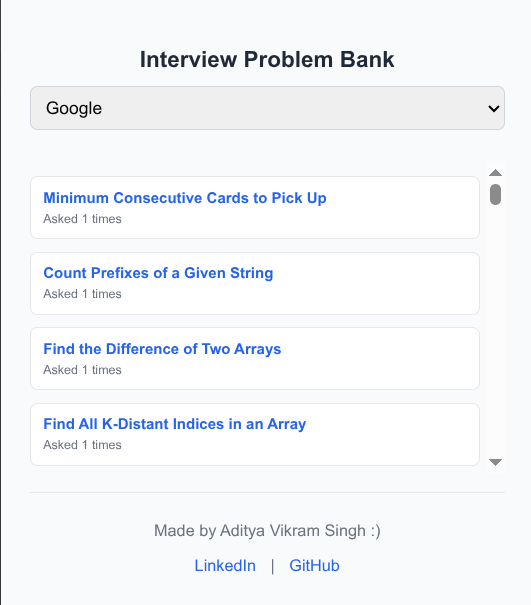

# 📌 LeetCode Company Problems – Chrome Extension

A lightweight Chrome Extension that helps you quickly browse and practice **LeetCode problems by company**.  
Each company has a dedicated list of questions (loaded from CSV files), so you can focus on the interviews that matter most 🚀.
I invite anyone who wants to update the questions so that it can help others as well!

---

## ✨ Features
- 🔍 Select a company and view its most frequently asked interview questions  
- 📑 Questions displayed in a clean **list view** with frequency counts  
- 🔗 Direct links to problems on LeetCode  
- 💾 Remembers your last selected company  
- 🎨 Simple, modern popup design with LinkedIn/GitHub footer  

---

## 🖼️ Screenshots
(Add your extension screenshots here)

- Popup interface  
  


---

📂 Project Structure
├── manifest.json
├── background.js
├── popup.html
├── popup.js
├── config.json
├── companies/
│   ├── Google.csv
│   ├── Amazon.csv
│   └── Microsoft.csv
└── assets/
    └── popup.png 


---

## ⚡ Installation

1. Clone this repo or download the source code:
     ```bash
       git clone https://github.com/adiv1kram/PrepSmart_ChromeExtension
2. Open Chrome and go to:
    -> chrome://extensions/
3. Enable Developer Mode (top-right corner).
4.Click Load unpacked and select the project folder.
5.The extension should now appear in your browser’s toolbar 🎉.
   

